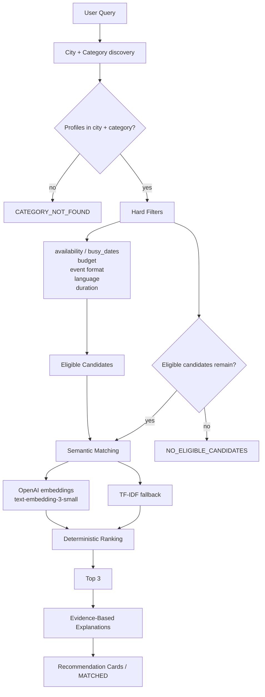

# MATCH
## Умный подбор event-подрядчиков

MATCH помогает выбрать до трёх подходящих подрядчиков из уже существующего каталога и объясняет, почему каждый из них попал в рекомендацию.

Это не расширение каталога и не поиск новых исполнителей. Пользователь уже получил каталог для своего города, а MATCH сокращает выбор до вариантов, которые проходят обязательные условия и лучше соответствуют пожеланиям.

## Проблема

Пользователь задаёт город, дату, формат мероприятия, категорию подрядчика и бюджет. Дополнительно можно указать язык, длительность и свободный текст с пожеланиями.

Проблема состоит не в том, чтобы показать ещё больше профилей. Нужно выбрать несколько подходящих профилей из существующего каталога и объяснить решение конкретными данными: ценой, форматом, языком, доступностью, длительностью и смысловым совпадением.

MATCH не использует generic-описания вроде «Отличный выбор для вашего мероприятия». Объяснения собираются из проверяемых фактов конкретного профиля.

## Что реализовано

- загрузка предоставленного CSV-каталога с сохранением исходных полей;
- поиск профилей по городу и категории;
- hard-фильтры по `busy_dates`, стартовой цене, формату мероприятия, языку и длительности;
- semantic matching пожеланий пользователя через OpenAI embeddings;
- детерминированный TF-IDF + cosine similarity fallback без OpenAI;
- гибридное ранжирование eligible-кандидатов;
- возврат максимум трёх рекомендаций на уровне `recommender.py`;
- evidence-based explanations на русском языке;
- прозрачные поля `synthetic`, `city_imputed` и `price_imputed`;
- Streamlit-интерфейс с карточками, empty states и диагностикой pipeline;
- автоматические тесты ranking, explanations и recommender;
- скрипт воспроизводимого поиска демонстрационных сценариев `scripts/find_demo_cases.py`.

## Как работает решение

1. Пользователь задаёт параметры события.
2. MATCH находит профили нужной категории в выбранном городе.
3. Hard filters исключают занятых, слишком дорогих и неподходящих по обязательным условиям подрядчиков.
4. Только среди оставшихся eligible-кандидатов рассчитывается смысловое соответствие пожеланиям.
5. Для каждого eligible-кандидата рассчитываются budget fit и duration flexibility.
6. Итоговый score используется для детерминированной сортировки.
7. `recommender.py` выбирает первые три строки ранжированного результата.
8. Для карточек формируются детерминированные evidence-based explanations.
9. Пользователь получает карточки или объяснение, почему результатов нет.

AI не может отменить hard constraints: занятый подрядчик, профиль выше бюджета или профиль с неподдерживаемым форматом не возвращается из ranking в рекомендации.

## Результаты поиска

### `MATCHED`

В городе и категории есть профили, и хотя бы один из них проходит все обязательные условия. Возвращается от одной до трёх карточек.

### `CATEGORY_NOT_FOUND`

В выбранном городе нет ни одного профиля запрошенной категории. Это отдельный результат, потому что проблема находится на уровне каталога, а не ограничений заказа.

### `NO_ELIGIBLE_CANDIDATES`

Профили категории в городе существуют, но все нарушают хотя бы одно условие: заняты на выбранную дату, имеют стартовую цену выше бюджета, не поддерживают формат или язык либо не проходят по длительности.

В диагностике одна строка может учитываться сразу по нескольким причинам. Поэтому counts причин не являются взаимоисключающими и не обязаны складываться в число профилей.

## AI и semantic matching

Основной semantic provider в `src/ranking.py` — модель OpenAI `text-embedding-3-small`. Пожелания пользователя используются как основной сигнал запроса, а представление подрядчика строится из `description`, `categories`, `event_formats` и `languages`. Сходство считается через cosine similarity.

OpenAI не выбирает подрядчиков напрямую и не получает право нарушать eligibility. Embeddings применяются только после hard filtering — для ранжирования уже допустимых кандидатов.

Если `OPENAI_API_KEY` отсутствует, OpenAI недоступен или embedding-запрос завершается ошибкой, ranking автоматически переключается на детерминированный TF-IDF + cosine similarity fallback. Fallback нужен для устойчивости MVP; OpenAI и TF-IDF могут по-разному оценивать смысловое совпадение.

## Ranking

Текущий итоговый score:

```text
final_score =
    0.65 × semantic_score
  + 0.25 × budget_score
  + 0.10 × duration_score
```

- `semantic_score` — соответствие текстовым пожеланиям и контексту запроса.
- `budget_score` — соответствие стартовой цены бюджету. Самый дешёвый профиль автоматически не считается лучшим.
- `duration_score` — запас по `max_hours`, если пользователь задал длительность. `NaN` означает, что длительность не привязана к физическому присутствию, и штраф не применяется.

`price_from_kzt` — стартовая цена «от», а не гарантированная итоговая стоимость заказа.

После расчёта score используется стабильная сортировка с такими ключами:

1. `final_score` по убыванию;
2. `price_from_kzt` по возрастанию;
3. `id` по возрастанию.

## Объяснимость и прозрачность

`src/explanations.py` не обращается к LLM для свободной генерации текста. Объяснение детерминированно собирается из evidence:

- стартовая цена относительно бюджета;
- формат мероприятия и доступность на дату, подтверждённые hard filtering;
- запрошенный язык;
- наибольший запас длительности среди рекомендаций;
- самое сильное semantic совпадение среди рекомендаций;
- самая низкая стартовая цена среди рекомендаций.

Набор причин ограничивается конкретными фактами профиля и запроса, поэтому карточки остаются различимыми даже без имени подрядчика.

Поля прозрачности `synthetic`, `city_imputed` и `price_imputed` сохраняются для интерфейса. Они описывают происхождение или восстановление данных и не являются положительными сигналами ranking.

## Данные

В каталоге `data/hackathon_dataset_anonymized.csv` находится 66 профилей и 17 категорий:

| Показатель | Значение |
|---|---:|
| Всего профилей | 66 |
| Алматы | 50 |
| Астана | 15 |
| Зарубежье | 1 |
| `synthetic=True` | 13 |
| `city_imputed=True` | 8 |
| `price_imputed=True` | 18 |
| `max_hours` не задан | 9 |

Плотные категории:

- Ведущий — 15 профилей;
- Фотограф — 12;
- Банкетный зал — 8.

В каталоге также есть редкие категории, включая категории с тремя профилями. Приложение не изменяет исходный CSV.

Это не задача supervised model training: в проекте нет обучения модели и train/test split. Система выполняет filtering и semantic ranking над уже существующим каталогом.

## Технологии

| Технология | Для чего используется |
|---|---|
| Python | код приложения и утилит |
| pandas | загрузка и обработка каталога |
| NumPy | численные операции со score и embeddings |
| scikit-learn | TF-IDF и cosine similarity fallback |
| OpenAI API | embeddings `text-embedding-3-small` |
| Streamlit | локальный пользовательский интерфейс |
| pytest | автоматические тесты |
| python-dotenv | доступная зависимость для локальной работы с `.env`, если она используется окружением |

## Архитектура



## Структура проекта

```text
app.py
requirements.txt
README.md
.env.example

data/
  hackathon_dataset_anonymized.csv

src/
  data_loader.py
  models.py
  filters.py
  ranking.py
  explanations.py
  recommender.py

scripts/
  find_demo_cases.py
  validate_data.py

tests/
  test_ranking.py
  test_explanations.py
  test_recommender.py
```

## Установка в Windows PowerShell

```powershell
git clone https://github.com/BAITC-Hacks/hack-55693f06-inzhunurlan.git
cd hack-55693f06-inzhunurlan

python -m venv .venv
.\.venv\Scripts\Activate.ps1

python -m pip install --upgrade pip
python -m pip install -r requirements.txt
```

Если PowerShell запрещает запуск скриптов активации, политика окружения может потребовать отдельной настройки. Это ограничение локального PowerShell, а не логики приложения.

## OpenAI API key

Настоящий ключ не хранится в репозитории. Для PowerShell можно задать placeholder так:

```powershell
$env:OPENAI_API_KEY="YOUR_OPENAI_API_KEY"
```

Для локальной настройки также доступен шаблон `.env.example`.

При отсутствии ключа приложение продолжает работу через TF-IDF fallback.

## Запуск

```powershell
streamlit run app.py
```

После запуска Streamlit обычно открывает локальное приложение по адресу [http://localhost:8501](http://localhost:8501).

## Проверка

```powershell
python -m pytest -q
python scripts/validate_data.py
python scripts/find_demo_cases.py
```

`scripts/validate_data.py` проверяет структуру и целостность предоставленного каталога до запуска recommendation pipeline.

Последний локально подтверждённый результат проекта:

```text
27 passed
```

Скрипт `scripts/find_demo_cases.py` не вызывает OpenAI и помогает воспроизвести четыре сценария на реальном датасете.

## Reproducible demo scenarios

### Demo 1 — dense category

- Город: Алматы
- Дата: `2026-09-26`
- Формат: конференция
- Категория: Ведущий
- Бюджет: `2 000 000 ₸`
- City/category candidates: 10
- Eligible: 3
- Отклонения: `busy = 6`, `wrong_format = 5`
- Результаты: `HK-44733 — Буллма`, `HK-88430 — Куррапика`, `HK-75012 — Джинбей`

### Demo 2 — rare category

- Город: Алматы
- Дата: `2026-09-23`
- Формат: конференция
- Категория: Флорист
- Бюджет: `250 000 ₸`
- City/category candidates: 2
- Eligible: 1
- Результат: `HK-39372 — Тони Тони Чоппер`

### Demo 3 — no eligible candidates

- Город: Алматы
- Дата: `2026-09-23`
- Формат: день рождения
- Категория: Ведущий
- Бюджет: `400 000 ₸`
- City/category candidates: 10
- Eligible: 0
- Причины: `busy = 4`, `over_budget = 10`, `wrong_format = 8`

Counts причин не являются взаимоисключающими: один профиль может одновременно быть занят, превышать бюджет и не поддерживать формат.

### Demo 4 — date sensitivity

Общие параметры: Алматы, конференция, Ведущий, бюджет `2 000 000 ₸`, язык и длительность не указаны.

- `2026-09-23`: eligible `HK-27222`, `HK-75012`;
- `2026-09-24`: eligible `HK-44733`, `HK-75012`.

Candidate pool меняется из-за `busy_dates` до semantic ranking. Разница не приписывается OpenAI.

## Детерминизм

Hard filtering выполняется по фиксированным значениям запроса и каталога. Ranking использует стабильные сортировки и явные tie-breakers: итоговый score по убыванию, затем стартовая цена по возрастанию и `id` по возрастанию.

Для OpenAI-ветки воспроизводимость также зависит от одинаковых результатов semantic provider. TF-IDF fallback является локальным и детерминированным.

## Ограничения MVP

- MATCH работает только с предоставленным каталогом и не добавляет новых подрядчиков.
- `price_from_kzt` — стартовая цена, а не финальная смета.
- Качество semantic matching зависит от заполненности и качества `description`, категорий, форматов и языков в каталоге.
- Доступность берётся из статических `busy_dates` в пределах hackathon date window.
- TF-IDF fallback может хуже передавать смысловые нюансы, чем embeddings.
- В проекте не реализованы бронирование, оплата, уведомления подрядчикам и внешняя синхронизация календарей.
- Каталог небольшой и содержит восстановленные/синтетические значения, отмеченные transparency flags.

## Дальнейшее развитие

Возможные направления, которые не являются частью текущей реализации:

- предварительное кэширование embeddings профилей;
- масштабирование semantic retrieval на большой каталог;
- feedback-based ranking;
- интеграции с реальными календарями;
- booking workflow;
- дополнительные embedding или reranking providers.

## Demo

Публичный deployment в текущем репозитории не настроен. Приложение запускается локально через Streamlit.

## Технический вывод

**Сначала ограничения. Затем смысл.** MATCH отделяет eligibility от preference: обязательные бизнес-условия проверяются детерминированно, а AI используется только для смыслового ранжирования уже допустимых кандидатов. Поэтому рекомендации остаются объяснимыми и не возвращают профиль только из-за высокого semantic score, если он не проходит hard filters.

